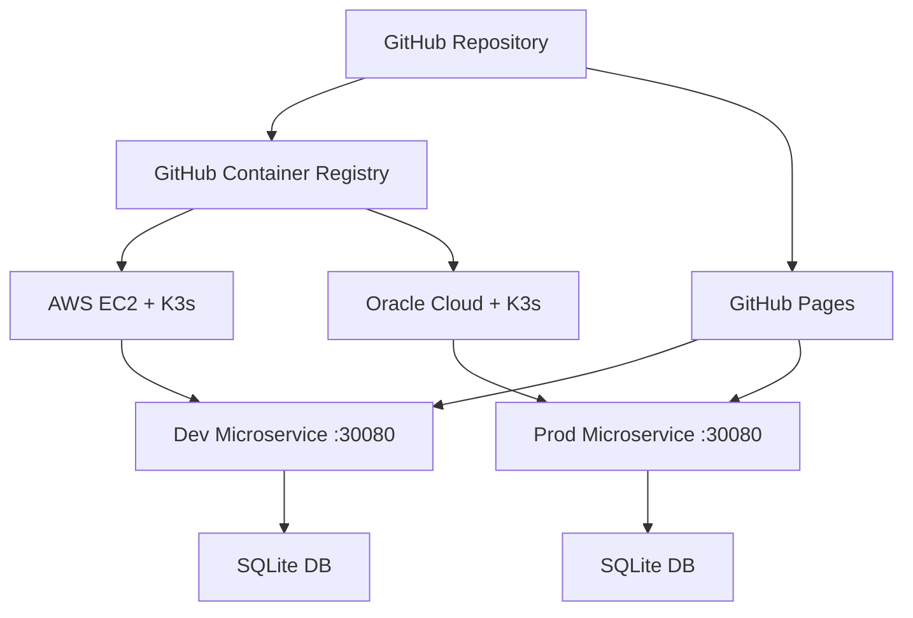
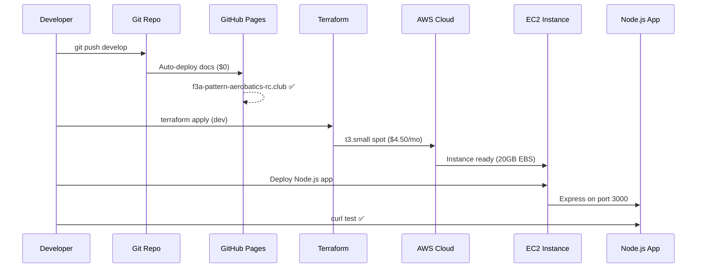
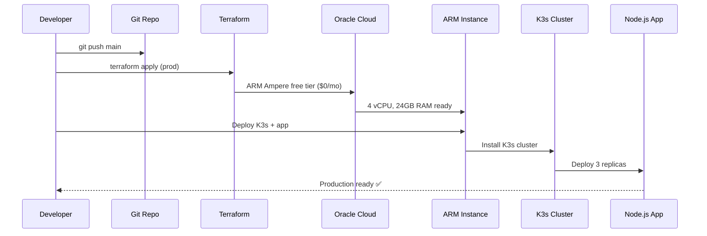

# F3A Pattern Aerobatics RC Club - Microservice v2

🚀 **Next-generation microservice for F3A Pattern Aerobatics RC Club**

Modern containerized microservice with API endpoints, health monitoring, and scalable Kubernetes deployment.

## 📁 Project Structure

```
f3a-microservice/
├── .github/workflows/     # 🔒 Security & CI/CD
│   └── security.yml       # Automated secret scanning
├── iac/                   # 🏗️ Infrastructure as Code (Terraform)
│   ├── main.tf            # AWS EC2 + VPC + security groups
│   ├── variables.tf       # Configuration parameters
│   ├── outputs.tf         # Instance details and access info
│   ├── user-data.sh       # K3s installation script
│   └── terraform.tfvars   # AWS configuration
├── k8s/                   # ☸️ Kubernetes Manifests
│   ├── namespace.yaml     # Isolated namespace
│   ├── deployment.yaml    # Application deployment
│   ├── service.yaml       # Service configuration
│   └── deploy.sh          # Deployment automation
├── app/                   # 🟢 Node.js Application
│   ├── package.json       # Dependencies
│   ├── server.js          # Express API server
│   ├── Dockerfile         # Container build
│   ├── healthcheck.js     # Health monitoring
│   ├── database/          # SQLite database
│   │   ├── f3a_brands.sql # Database schema
│   │   └── f3a.db         # SQLite database file
│   ├── data/              # JSON data files
│   │   ├── brands.json    # F3A brands data
│   │   ├── categories.json # Component categories
│   │   ├── events.json    # Club events
│   │   └── aircraft.json  # Aircraft specifications
│   └── public/            # Web assets
│       ├── index.html     # Frontend
│       ├── style.css      # Styling
│       └── app.js         # Client-side JS
├── scripts/               # 🔧 Automation Scripts
│   ├── deploy.sh          # Full deployment
│   └── simple-deploy.sh   # Basic deployment
├── .pre-commit-config.yaml # Pre-commit hooks
├── .secrets.baseline      # Secret scanning baseline
├── Makefile               # Workflow automation
└── .gitignore             # Git ignore rules
```

## 🚀 Quick Start

### Prerequisites
- AWS CLI configured
- Terraform installed
- Domain: `f3a-pattern-aerobatics-rc.club`
- Hosted Zone: `Z00071653MWP8XE0V1MUU`

### Setup & Deploy
```bash
# Setup security tools
make setup

# Deploy infrastructure
make deploy-infra

# Deploy application
make deploy-app

# Or deploy everything
make deploy

# Test endpoints
make test

# Configure GitHub Pages
make setup-pages
```

### GitHub Pages Setup
```bash
# Enable GitHub Pages (already configured via workflow)
gh api repos/:owner/:repo/pages

# Add custom domain CNAME file
echo "f3a-pattern-aerobatics-rc.club" > app/public/v2/CNAME
git add app/public/v2/CNAME
git commit -m "Add CNAME for GitHub Pages custom domain"
git push

# Update DNS to point to GitHub Pages
aws route53 change-resource-record-sets --hosted-zone-id Z00071653MWP8XE0V1MUU --change-batch '{
  "Changes": [{
    "Action": "UPSERT",
    "ResourceRecordSet": {
      "Name": "f3a-pattern-aerobatics-rc.club",
      "Type": "A",
      "TTL": 300,
      "ResourceRecords": [
        {"Value": "185.199.108.153"},
        {"Value": "185.199.109.153"},
        {"Value": "185.199.110.153"},
        {"Value": "185.199.111.153"}
      ]
    }
  }]
}'

# Check deployment status
gh run list --workflow=pages.yml --limit=1

# Test both URLs
curl -siL https://considerable.github.io/f3a-microservice/
curl -siL https://f3a-pattern-aerobatics-rc.club
```

### Access URLs
- **Main Site**: `https://f3a-pattern-aerobatics-rc.club` (GitHub Pages)
- **GitHub Pages**: `https://considerable.github.io/f3a-microservice/`
- **Microservice**: `http://app.f3a-pattern-aerobatics-rc.club:30080`
- **Health Check**: `http://app.f3a-pattern-aerobatics-rc.club:30080/health`
- **Club API**: `http://app.f3a-pattern-aerobatics-rc.club:30080/api/club`
- **Events API**: `http://app.f3a-pattern-aerobatics-rc.club:30080/api/events`
- **Aircraft API**: `http://app.f3a-pattern-aerobatics-rc.club:30080/api/aircraft`
- **Brands API**: `http://app.f3a-pattern-aerobatics-rc.club:30080/api/brands`
- **Categories API**: `http://app.f3a-pattern-aerobatics-rc.club:30080/api/categories`
- **Components API**: `http://app.f3a-pattern-aerobatics-rc.club:30080/api/components/{category}`
- **Legacy S3**: `http://s3.f3a-pattern-aerobatics-rc.club` (HTTP only - S3 static hosting doesn't support HTTPS)
- **S3 Direct**: `http://s3.f3a-pattern-aerobatics-rc.club.s3-website-us-west-2.amazonaws.com`

> **Note**: S3 static website hosting only supports HTTP. For HTTPS, use GitHub Pages or add CloudFront distribution.

## 🎯 Features

- ✅ **Multi-tier architecture**: GitHub Pages + K3s + S3
- ✅ **Kubernetes-native**: Full K8s deployment
- ✅ **API-first**: RESTful endpoints
- ✅ **Health monitoring**: Liveness/readiness probes
- ✅ **Auto-scaling**: HPA ready
- ✅ **DNS integration**: Route53 automation
- ✅ **Cost-optimized**: Spot instances (~70% savings)
- ✅ **Security scanning**: Automated secret detection
- ✅ **Pre-commit hooks**: Local security validation
- ✅ **CORS enabled**: GitHub Pages integration ready
- ✅ **Client-side integration**: JavaScript fetch API support
- ✅ **SQLite database**: Local database with JSON data sources
- ✅ **F3A components**: Brands, categories, and aircraft specifications
- ✅ **Git-based data**: Version-controlled JSON data files
- ✅ **GHCR integration**: GitHub Container Registry for multi-cloud
- ✅ **Multi-cloud ready**: Same container image for AWS + Oracle
- ✅ **Zero vendor lock-in**: Cloud-agnostic architecture

## 🔄 Deployment Strategy

**Main Domain** (`f3a-pattern-aerobatics-rc.club`):
- GitHub Pages for static content, documentation
- Fast CDN delivery, zero cost

**App Subdomain** (`app.f3a-pattern-aerobatics-rc.club`):
- Dynamic microservice with APIs
- Kubernetes orchestration
- Real-time data processing

**S3 Subdomain** (`s3.f3a-pattern-aerobatics-rc.club`):
- Legacy static site (HTTP only - S3 limitation)
- Backup/archive content
- Direct endpoint: `s3.f3a-pattern-aerobatics-rc.club.s3-website-us-west-2.amazonaws.com`

## 🏗️ Architecture

### Multi-Cloud Container Architecture


### DNS Structure
```
f3a-pattern-aerobatics-rc.club     → GitHub Pages (main site)
app.f3a-pattern-aerobatics-rc.club  → K3s Microservice (this project)
s3.f3a-pattern-aerobatics-rc.club   → S3 Static Site (legacy)
```

### Development Flow (AWS)


### Production Flow (Oracle Cloud)


### Complete Multi-Cloud Architecture Flow
```
GitHub Repository ──→ GitHub Container Registry (GHCR)
        │                           │
        ↓                           ↓
   GitHub Pages ────────────→ Multi-Cloud K3s Deployments
        │                           │
        ↓                           ↓
Static Frontend ←──────────→ AWS Dev + Oracle Prod
        │                           │
        ↓                           ↓
   API Calls ──────────────→ Express + SQLite
```

### Container Registry Strategy
**GitHub Container Registry (GHCR):**
- ✅ **Multi-Cloud**: Works with AWS, Oracle, any Kubernetes
- ✅ **Zero Cost**: Free for public repositories
- ✅ **Global CDN**: Fast image pulls worldwide
- ✅ **Integrated**: Same GitHub authentication as code
- ✅ **No Vendor Lock-in**: Cloud-agnostic container storage

**Image Flow:**
```bash
# Build once, deploy anywhere
docker build -t ghcr.io/considerable/f3a-microservice:latest .
docker push ghcr.io/considerable/f3a-microservice:latest

# Deploy to AWS K3s
kubectl set image deployment/f3a-app f3a-app=ghcr.io/considerable/f3a-microservice:latest

# Deploy to Oracle K3s (same image)
kubectl set image deployment/f3a-app f3a-app=ghcr.io/considerable/f3a-microservice:latest
```

### Hybrid Architecture Benefits

**Static Layer (GitHub Pages):**
- Club information pages, documentation, photo galleries
- Global CDN delivery, perfect SEO, zero server costs
- Instant loading, high availability

**Dynamic Layer (Node.js Microservice):**
- Live event data, member registration, flight logs
- Real-time API responses, database interactions
- Scalable processing, business logic

**Perfect Division:**
```javascript
// GitHub Pages: Static club page with dynamic content injection
<div id="next-event">Loading next event...</div>

// JavaScript fetches live data from microservice
fetch('https://app.f3a-pattern-aerobatics-rc.club:30080/api/events')
  .then(response => response.json())
  .then(data => {
    document.getElementById('next-event').innerHTML =
      `Next Event: ${data.upcoming[0].title} on ${data.upcoming[0].date}`;
  });
```

**Enterprise-grade architecture at hobby project cost!**

## 💰 Cost Estimate
- **Development**: ~$4.50/month (AWS t3.small spot)
- **Production**: $0/month (Oracle Cloud free tier)
- **Database**: $0/month (SQLite local file)
- **Total**: $4.50/month for full dev + prod setup
- **Savings**: 70% vs AWS on-demand + 100% database savings

## 💾 Database Strategy

**SQLite with JSON Data Sources:**
- **Storage**: Local SQLite database file
- **Data Sources**: JSON files in Git repository
- **Initialization**: Database populated from JSON on startup
- **Version Control**: Data changes tracked in Git
- **Zero Cost**: No external database service required
- **Simplicity**: Single-file database, no network dependencies

**Database Architecture:**
```javascript
const sqlite3 = require('sqlite3');
const fs = require('fs');

// Initialize database from JSON files
const db = new sqlite3.Database('./database/f3a.db');
const brands = JSON.parse(fs.readFileSync('./data/brands.json'));
const events = JSON.parse(fs.readFileSync('./data/events.json'));

// Populate database on startup
brands.forEach(brand => {
  db.run('INSERT INTO brands (name, specialty) VALUES (?, ?)',
    [brand.name, brand.specialty]);
});
```

**Data Management:**
- **Development**: Edit JSON files, restart service
- **Production**: Git push triggers database refresh
- **Backup**: Git repository serves as backup
- **Migration**: Schema changes via SQL files in Git

## 🔗 GitHub Pages Integration

### Client-Side API Consumption
The microservice is configured with CORS to allow GitHub Pages to consume APIs:

```javascript
// Example: Fetch club information
const API_BASE = 'https://app.f3a-pattern-aerobatics-rc.club:30080';

async function loadClubInfo() {
  try {
    const response = await fetch(`${API_BASE}/api/club`);
    const data = await response.json();
    document.getElementById('club-name').textContent = data.name;
  } catch (error) {
    console.error('Failed to load club info:', error);
  }
}

// Load on page ready
document.addEventListener('DOMContentLoaded', loadClubInfo);
```

### Integration Benefits
- ✅ **Cost Optimization**: Static content free, only pay for dynamic features
- ✅ **Performance**: Fast static delivery + responsive APIs
- ✅ **Scalability**: GitHub's CDN + your scalable microservice
- ✅ **Flexibility**: Update static content via Git, dynamic data via APIs
- ✅ **Reliability**: GitHub's uptime + your redundant microservice

## 🟨 JavaScript Technology Stack

### Backend API (Node.js)
- **Express.js**: Web framework for REST API endpoints
- **CORS**: Cross-origin resource sharing for GitHub Pages integration
- **Helmet**: Security middleware for HTTP headers
- **Compression**: Response compression middleware

### Frontend UI (Vanilla JavaScript)
- **ES6+ Classes**: Modern JavaScript with `F3AApp` class architecture
- **Fetch API**: Native browser API for HTTP requests
- **Async/Await**: Modern asynchronous JavaScript patterns
- **DOM Manipulation**: Direct DOM API usage (no frameworks)
- **Event Listeners**: Native browser event handling

### Architecture Style
- **No Frontend Framework**: Pure vanilla JavaScript (no React/Vue/Angular)
- **RESTful APIs**: Standard HTTP endpoints returning JSON
- **Progressive Enhancement**: Works without JavaScript, enhanced with it
- **Responsive Design**: CSS-based responsive layout

### Key JavaScript Features

**Frontend (`app.js`):**
```javascript
// ES6 Class-based architecture
class F3AApp {
  constructor() {
    this.apiBase = 'http://app.f3a-pattern-aerobatics-rc.club:30080';
  }

  // Async/await for API calls
  async loadClubInfo() {
    const response = await fetch(`${this.apiBase}/api/club`);
    const data = await response.json();
  }

  // Template literals for HTML generation
  container.innerHTML = `<div class="card">${club.name}</div>`;
}
```

**Backend (`server.js`):**
```javascript
// Express.js REST API
app.get('/api/club', (req, res) => {
  res.json({ name: 'F3A Pattern Aerobatics RC Club' });
});

// CORS configuration for GitHub Pages
app.use(cors({
  origin: ['https://f3a-pattern-aerobatics-rc.club']
}));
```

**Lightweight, framework-free approach perfect for club websites with dynamic API integration!** ✅ **Performance**: Fast static delivery + responsive APIs
- ✅ **Scalability**: GitHub's CDN + your scalable microservice
- ✅ **Flexibility**: Update static content via Git, dynamic data via APIs
- ✅ **Reliability**: GitHub's uptime + your redundant microservice

## 🔒 Security

### Automated Secret Scanning
- **GitHub Actions**: Trivy scanner on every push/PR
- **Pre-commit hooks**: Local validation before commits
- **Baseline scanning**: No secrets detected in codebase

### Two-Layer Protection
**Local (Pre-commit):**
- Runs `detect-secrets` before each commit
- Blocks commits containing API keys, tokens, passwords
- Validates YAML files and removes large files

**CI/CD (GitHub Actions):**
- Trivy security scanner on push/PR to main/develop
- Results uploaded to GitHub Security tab
- Prevents merging if secrets detected

### Security Features
- Encrypted EBS volumes
- Security groups with minimal access
- Environment variable configuration
- No hardcoded credentials

## 🌐 GitHub Pages Configuration

### Automatic Deployment
GitHub Actions workflow automatically deploys from `app/public/v2/` on every push to main branch.

### Custom Domain Setup
1. **CNAME File**: `app/public/v2/CNAME` contains custom domain
2. **DNS Configuration**: A records point to GitHub Pages IPs
3. **HTTPS**: Automatically enabled by GitHub Pages

### Commands Reference
```bash
# Check Pages status
gh api repos/:owner/:repo/pages

# View deployment logs
gh run list --workflow=pages.yml

# Test endpoints
curl -siL https://considerable.github.io/f3a-microservice/
curl -siL https://f3a-pattern-aerobatics-rc.club
```

### GitHub Pages IPs (for DNS)
```
185.199.108.153
185.199.109.153
185.199.110.153
185.199.111.153
```

## 📦 Container Registry (GHCR)

### Automated Docker Builds
GitHub Actions automatically builds and pushes Docker images to GHCR on every push to main.

### Multi-Cloud Deployment
```bash
# Image is built once and deployed to multiple clouds
Image: ghcr.io/considerable/f3a-microservice:latest

# AWS K3s Deployment
kubectl set image deployment/f3a-app f3a-app=ghcr.io/considerable/f3a-microservice:latest -n f3a-microservice

# Oracle K3s Deployment (same image)
kubectl set image deployment/f3a-app f3a-app=ghcr.io/considerable/f3a-microservice:latest -n f3a-microservice
```

### Container Registry Benefits
- **🌍 Global CDN**: Fast pulls from any cloud
- **💰 Zero Cost**: Free for public repositories
- **🔒 Secure**: GitHub authentication integration
- **☁️ Multi-Cloud**: Works with AWS, Oracle, any K8s
- **🚀 Automated**: CI/CD builds on code changes Security groups with minimal access
- Environment variable configuration
- No hardcoded credentials

## 🛠️ IaC Language Choices

### Infrastructure (Terraform) ✅
- **AWS Resources**: VPC, EC2, Route53, Security Groups
- **State Management**: Remote state, drift detection
- **Multi-Cloud**: AWS (dev) + Oracle (prod)

### K3s Installation (User-Data Script) ✅
- **Cloud-Init**: Automated K3s + Docker installation
- **Simple & Reliable**: No SSH required
- **Cloud-Agnostic**: Works on AWS and Oracle

### Application Deployment
- **Container Registry**: GitHub Container Registry (GHCR)
- **Image Build**: GitHub Actions automated builds
- **Multi-Cloud Deploy**: Same image to AWS + Oracle K3s
- **GitOps**: ArgoCD (future consideration)

## 🌍 Multi-Environment Strategy

### Development (AWS)
```yaml
Instance: t3.small spot (2 vCPU, 2GB RAM)
Cost: $4.50/month
Replicas: 1
Resources: 500m CPU, 512Mi RAM
```

### Production (Oracle Cloud)
```yaml
Instance: ARM Ampere (4 vCPU, 24GB RAM)
Cost: $0/month (free tier)
Replicas: 3
Resources: 1000m CPU, 1Gi RAM
```

### Deployment Commands
```bash
# Build and push to GHCR (automated via GitHub Actions)
git push origin main

# Deploy to AWS K3s
./k8s/deploy.sh

# Deploy to Oracle K3s (same image)
./k8s/deploy.sh

# Manual image update
kubectl set image deployment/f3a-app f3a-app=ghcr.io/considerable/f3a-microservice:latest -n f3a-microservice
```

## 🚀 Current Deployment
- **Instance**: `t3.small-spot-4.50mo` (i-0b7ad2ad5f09be2b7)
- **IP**: 44.246.134.59
- **Region**: us-west-2
- **AMI**: Amazon Linux 2023
- **EBS**: 20GB GP3 (encrypted)
- **SSH**: `ssh -i ~/.ssh/id_rsa ec2-user@44.246.134.59`
- **Status**: ✅ **DEPLOYED AND CORS ENABLED**

## 📝 Deployment Log

### Infrastructure Deployed ✅
```bash
# Terraform successfully created:
# - VPC with public subnet
# - t3.small spot instance (~70% cost savings)
# - 20GB encrypted EBS volume
# - Security groups (SSH, HTTP, HTTPS, K3s, NodePort, 3000)
# - Route53 DNS: app.f3a-pattern-aerobatics-rc.club → <your-instance-ip>
# - SSH key integration with ~/.ssh/id_rsa
```

### Application Deployment ✅
```bash
# Node.js 18.20.8 installed successfully
# Express microservice running on port 3000
# All endpoints tested and working
```

### Test Results ✅
```bash
# Health Check
curl -s http://<your-instance-ip>:3000/health | jq
{
  "status": "healthy",
  "timestamp": "2025-11-08T20:15:28.233Z",
  "service": "f3a-microservice",
  "version": "1.0.0"
}

# Club API
curl -s http://<your-instance-ip>:3000/api/club | jq
{
  "name": "F3A Pattern Aerobatics RC Club",
  "description": "Precision aerobatic flying with radio-controlled aircraft",
  "location": "Pacific Northwest",
  "founded": "1985",
  "activities": [
    "F3A Pattern Competition",
    "Training Workshops",
    "Monthly Fly-ins",
    "Equipment Reviews"
  ]
}

# Events API
curl -s http://<your-instance-ip>:3000/api/events | jq
{
  "upcoming": [
    {
      "id": 1,
      "title": "Monthly Club Meeting",
      "date": "2024-12-07",
      "time": "10:00 AM",
      "location": "Club Field"
    }
  ]
}
```
