# F3A Pattern Aerobatics RC Club - Microservice v2

🚀 **Next-generation microservice for F3A Pattern Aerobatics RC Club**

Modern containerized microservice with API endpoints, health monitoring, and scalable Kubernetes deployment.

## 📁 Project Structure

```
f3a-microservice/
├── .github/workflows/     # 🔒 Security & CI/CD
│   └── security.yml       # Automated secret scanning
├── iac/                   # 🏗️ Infrastructure as Code (Terraform)
│   ├── main.tf            # AWS EC2 + VPC + security groups
│   ├── variables.tf       # Configuration parameters
│   ├── outputs.tf         # Instance details and access info
│   ├── user-data.sh       # K3s installation script
│   └── terraform.tfvars   # AWS configuration
├── k8s/                   # ☸️ Kubernetes Manifests
│   ├── namespace.yaml     # Isolated namespace
│   ├── deployment.yaml    # Application deployment
│   ├── service.yaml       # Service configuration
│   └── deploy.sh          # Deployment automation
├── app/                   # 🟢 Node.js Application
│   ├── package.json       # Dependencies
│   ├── server.js          # Express API server
│   ├── Dockerfile         # Container build
│   ├── healthcheck.js     # Health monitoring
│   ├── database/          # SQLite database
│   │   ├── f3a_brands.sql # Database schema
│   │   └── f3a.db         # SQLite database file
│   ├── data/              # JSON data files
│   │   ├── brands.json    # F3A brands data
│   │   ├── categories.json # Component categories
│   │   ├── events.json    # Club events
│   │   └── aircraft.json  # Aircraft specifications
│   └── public/            # Web assets
│       ├── index.html     # Frontend
│       ├── style.css      # Styling
│       └── app.js         # Client-side JS
├── scripts/               # 🔧 Automation Scripts
│   ├── deploy.sh          # Full deployment
│   └── simple-deploy.sh   # Basic deployment
├── .pre-commit-config.yaml # Pre-commit hooks
├── .secrets.baseline      # Secret scanning baseline
├── Makefile               # Workflow automation
└── .gitignore             # Git ignore rules
```

## 🚀 Quick Start

### Prerequisites
- AWS CLI configured
- Terraform installed
- Domain: `f3a-pattern-aerobatics-rc.club`
- Hosted Zone: `Z00071653MWP8XE0V1MUU`

### Setup & Deploy
```bash
# Setup security tools
make setup

# Deploy infrastructure
make deploy-infra

# Deploy application
make deploy-app

# Or deploy everything
make deploy

# Test endpoints
make test

# Configure GitHub Pages
make setup-pages
```

### GitHub Pages Setup
```bash
# Enable GitHub Pages (already configured via workflow)
gh api repos/:owner/:repo/pages

# Add custom domain CNAME file
echo "f3a-pattern-aerobatics-rc.club" > app/public/v2/CNAME
git add app/public/v2/CNAME
git commit -m "Add CNAME for GitHub Pages custom domain"
git push

# Update DNS to point to GitHub Pages
aws route53 change-resource-record-sets --hosted-zone-id Z00071653MWP8XE0V1MUU --change-batch '{
  "Changes": [{
    "Action": "UPSERT",
    "ResourceRecordSet": {
      "Name": "f3a-pattern-aerobatics-rc.club",
      "Type": "A",
      "TTL": 300,
      "ResourceRecords": [
        {"Value": "185.199.108.153"},
        {"Value": "185.199.109.153"},
        {"Value": "185.199.110.153"},
        {"Value": "185.199.111.153"}
      ]
    }
  }]
}'

# Check deployment status
gh run list --workflow=pages.yml --limit=1

# Test both URLs
curl -siL https://considerable.github.io/f3a-microservice/
curl -siL https://f3a-pattern-aerobatics-rc.club
```

### Access URLs
- **Main Site**: `https://f3a-pattern-aerobatics-rc.club` (GitHub Pages)
- **GitHub Pages**: `https://considerable.github.io/f3a-microservice/`
- **Microservice**: `http://app.f3a-pattern-aerobatics-rc.club:30080`
- **Health Check**: `http://app.f3a-pattern-aerobatics-rc.club:30080/health`
- **Club API**: `http://app.f3a-pattern-aerobatics-rc.club:30080/api/club`
- **Events API**: `http://app.f3a-pattern-aerobatics-rc.club:30080/api/events`
- **Aircraft API**: `http://app.f3a-pattern-aerobatics-rc.club:30080/api/aircraft`
- **Brands API**: `http://app.f3a-pattern-aerobatics-rc.club:30080/api/brands`
- **Categories API**: `http://app.f3a-pattern-aerobatics-rc.club:30080/api/categories`
- **Components API**: `http://app.f3a-pattern-aerobatics-rc.club:30080/api/components/{category}`
- **Legacy S3**: `http://s3.f3a-pattern-aerobatics-rc.club` (HTTP only - S3 static hosting doesn't support HTTPS)
- **S3 Direct**: `http://s3.f3a-pattern-aerobatics-rc.club.s3-website-us-west-2.amazonaws.com`

> **Note**: S3 static website hosting only supports HTTP. For HTTPS, use GitHub Pages or add CloudFront distribution.

## 🎯 Features

- ✅ **Multi-tier architecture**: GitHub Pages + K3s + S3
- ✅ **Kubernetes-native**: Full K8s deployment
- ✅ **API-first**: RESTful endpoints
- ✅ **Health monitoring**: Liveness/readiness probes
- ✅ **Auto-scaling**: HPA ready
- ✅ **DNS integration**: Route53 automation
- ✅ **Cost-optimized**: Spot instances (~70% savings)
- ✅ **Security scanning**: Automated secret detection
- ✅ **Pre-commit hooks**: Local security validation
- ✅ **CORS enabled**: GitHub Pages integration ready
- ✅ **Client-side integration**: JavaScript fetch API support
- ✅ **SQLite database**: Local database with JSON data sources
- ✅ **F3A components**: Brands, categories, and aircraft specifications
- ✅ **Git-based data**: Version-controlled JSON data files

## 🔄 Deployment Strategy

**Main Domain** (`f3a-pattern-aerobatics-rc.club`):
- GitHub Pages for static content, documentation
- Fast CDN delivery, zero cost

**App Subdomain** (`app.f3a-pattern-aerobatics-rc.club`):
- Dynamic microservice with APIs
- Kubernetes orchestration
- Real-time data processing

**S3 Subdomain** (`s3.f3a-pattern-aerobatics-rc.club`):
- Legacy static site (HTTP only - S3 limitation)
- Backup/archive content
- Direct endpoint: `s3.f3a-pattern-aerobatics-rc.club.s3-website-us-west-2.amazonaws.com`

## 🏗️ Architecture

### DNS Structure
```
f3a-pattern-aerobatics-rc.club     → GitHub Pages (main site)
app.f3a-pattern-aerobatics-rc.club  → K3s Microservice (this project)
s3.f3a-pattern-aerobatics-rc.club   → S3 Static Site (legacy)
```

### Development Flow (AWS)

```mermaid
sequenceDiagram
    participant Dev as Developer
    participant Git as Git Repo
    participant GH as GitHub Pages
    participant TF as Terraform
    participant AWS as AWS Cloud
    participant EC2 as EC2 Instance
    participant App as Node.js App

    Dev->>Git: git push develop
    Git->>GH: Auto-deploy docs ($0)
    GH-->>GH: f3a-pattern-aerobatics-rc.club ✅

    Dev->>TF: terraform apply (dev)
    TF->>AWS: t3.small spot ($4.50/mo)
    AWS->>EC2: Instance ready (20GB EBS)
    Dev->>EC2: Deploy Node.js app
    EC2->>App: Express on port 3000
    Dev->>App: curl test ✅
```


### Production Flow (Oracle Cloud)


### Complete Architecture Flow
```
GitHub Pages ────→ f3a-pattern-aerobatics-rc.club (Static Site)
                                    ↓
Route53 DNS ─────→ app.f3a-pattern-aerobatics-rc.club
                                    ↓
              EC2/Oracle → K3s → NodePort → Express API
                                                ↓
                                           Modern Web UI
                                                ↓
                                          SQLite DB
```

### Hybrid Architecture Benefits

**Static Layer (GitHub Pages):**
- Club information pages, documentation, photo galleries
- Global CDN delivery, perfect SEO, zero server costs
- Instant loading, high availability

**Dynamic Layer (Node.js Microservice):**
- Live event data, member registration, flight logs
- Real-time API responses, database interactions
- Scalable processing, business logic

**Perfect Division:**
```javascript
// GitHub Pages: Static club page with dynamic content injection
<div id="next-event">Loading next event...</div>

// JavaScript fetches live data from microservice
fetch('https://app.f3a-pattern-aerobatics-rc.club:30080/api/events')
  .then(response => response.json())
  .then(data => {
    document.getElementById('next-event').innerHTML =
      `Next Event: ${data.upcoming[0].title} on ${data.upcoming[0].date}`;
  });
```

**Enterprise-grade architecture at hobby project cost!**

## 💰 Cost Estimate
- **Development**: ~$4.50/month (AWS t3.small spot)
- **Production**: $0/month (Oracle Cloud free tier)
- **Database**: $0/month (SQLite local file)
- **Total**: $4.50/month for full dev + prod setup
- **Savings**: 70% vs AWS on-demand + 100% database savings

## 💾 Database Strategy

**SQLite with JSON Data Sources:**
- **Storage**: Local SQLite database file
- **Data Sources**: JSON files in Git repository
- **Initialization**: Database populated from JSON on startup
- **Version Control**: Data changes tracked in Git
- **Zero Cost**: No external database service required
- **Simplicity**: Single-file database, no network dependencies

**Database Architecture:**
```javascript
const sqlite3 = require('sqlite3');
const fs = require('fs');

// Initialize database from JSON files
const db = new sqlite3.Database('./database/f3a.db');
const brands = JSON.parse(fs.readFileSync('./data/brands.json'));
const events = JSON.parse(fs.readFileSync('./data/events.json'));

// Populate database on startup
brands.forEach(brand => {
  db.run('INSERT INTO brands (name, specialty) VALUES (?, ?)',
    [brand.name, brand.specialty]);
});
```

**Data Management:**
- **Development**: Edit JSON files, restart service
- **Production**: Git push triggers database refresh
- **Backup**: Git repository serves as backup
- **Migration**: Schema changes via SQL files in Git

## 🔗 GitHub Pages Integration

### Client-Side API Consumption
The microservice is configured with CORS to allow GitHub Pages to consume APIs:

```javascript
// Example: Fetch club information
const API_BASE = 'https://app.f3a-pattern-aerobatics-rc.club:30080';

async function loadClubInfo() {
  try {
    const response = await fetch(`${API_BASE}/api/club`);
    const data = await response.json();
    document.getElementById('club-name').textContent = data.name;
  } catch (error) {
    console.error('Failed to load club info:', error);
  }
}

// Load on page ready
document.addEventListener('DOMContentLoaded', loadClubInfo);
```

### Integration Benefits
- ✅ **Cost Optimization**: Static content free, only pay for dynamic features
- ✅ **Performance**: Fast static delivery + responsive APIs
- ✅ **Scalability**: GitHub's CDN + your scalable microservice
- ✅ **Flexibility**: Update static content via Git, dynamic data via APIs
- ✅ **Reliability**: GitHub's uptime + your redundant microservice

## 🟨 JavaScript Technology Stack

### Backend API (Node.js)
- **Express.js**: Web framework for REST API endpoints
- **CORS**: Cross-origin resource sharing for GitHub Pages integration
- **Helmet**: Security middleware for HTTP headers
- **Compression**: Response compression middleware

### Frontend UI (Vanilla JavaScript)
- **ES6+ Classes**: Modern JavaScript with `F3AApp` class architecture
- **Fetch API**: Native browser API for HTTP requests
- **Async/Await**: Modern asynchronous JavaScript patterns
- **DOM Manipulation**: Direct DOM API usage (no frameworks)
- **Event Listeners**: Native browser event handling

### Architecture Style
- **No Frontend Framework**: Pure vanilla JavaScript (no React/Vue/Angular)
- **RESTful APIs**: Standard HTTP endpoints returning JSON
- **Progressive Enhancement**: Works without JavaScript, enhanced with it
- **Responsive Design**: CSS-based responsive layout

### Key JavaScript Features

**Frontend (`app.js`):**
```javascript
// ES6 Class-based architecture
class F3AApp {
  constructor() {
    this.apiBase = 'http://app.f3a-pattern-aerobatics-rc.club:30080';
  }

  // Async/await for API calls
  async loadClubInfo() {
    const response = await fetch(`${this.apiBase}/api/club`);
    const data = await response.json();
  }

  // Template literals for HTML generation
  container.innerHTML = `<div class="card">${club.name}</div>`;
}
```

**Backend (`server.js`):**
```javascript
// Express.js REST API
app.get('/api/club', (req, res) => {
  res.json({ name: 'F3A Pattern Aerobatics RC Club' });
});

// CORS configuration for GitHub Pages
app.use(cors({
  origin: ['https://f3a-pattern-aerobatics-rc.club']
}));
```

**Lightweight, framework-free approach perfect for club websites with dynamic API integration!** ✅ **Performance**: Fast static delivery + responsive APIs
- ✅ **Scalability**: GitHub's CDN + your scalable microservice
- ✅ **Flexibility**: Update static content via Git, dynamic data via APIs
- ✅ **Reliability**: GitHub's uptime + your redundant microservice

## 🔒 Security

### Automated Secret Scanning
- **GitHub Actions**: Trivy scanner on every push/PR
- **Pre-commit hooks**: Local validation before commits
- **Baseline scanning**: No secrets detected in codebase

### Two-Layer Protection
**Local (Pre-commit):**
- Runs `detect-secrets` before each commit
- Blocks commits containing API keys, tokens, passwords
- Validates YAML files and removes large files

**CI/CD (GitHub Actions):**
- Trivy security scanner on push/PR to main/develop
- Results uploaded to GitHub Security tab
- Prevents merging if secrets detected

### Security Features
- Encrypted EBS volumes
- Security groups with minimal access
- Environment variable configuration
- No hardcoded credentials

## 🌐 GitHub Pages Configuration

### Automatic Deployment
GitHub Actions workflow automatically deploys from `app/public/v2/` on every push to main branch.

### Custom Domain Setup
1. **CNAME File**: `app/public/v2/CNAME` contains custom domain
2. **DNS Configuration**: A records point to GitHub Pages IPs
3. **HTTPS**: Automatically enabled by GitHub Pages

### Commands Reference
```bash
# Check Pages status
gh api repos/:owner/:repo/pages

# View deployment logs
gh run list --workflow=pages.yml

# Test endpoints
curl -siL https://considerable.github.io/f3a-microservice/
curl -siL https://f3a-pattern-aerobatics-rc.club
```

### GitHub Pages IPs (for DNS)
```
185.199.108.153
185.199.109.153
185.199.110.153
185.199.111.153
``` Security groups with minimal access
- Environment variable configuration
- No hardcoded credentials

## 🛠️ IaC Language Choices

### Infrastructure (Terraform) ✅
- **AWS Resources**: VPC, EC2, Route53, Security Groups
- **State Management**: Remote state, drift detection
- **Multi-Cloud**: AWS (dev) + Oracle (prod)

### K3s Installation (User-Data Script) ✅
- **Cloud-Init**: Automated K3s + Docker installation
- **Simple & Reliable**: No SSH required
- **Cloud-Agnostic**: Works on AWS and Oracle

### Application Deployment
- **Single Environment**: `kubectl apply` (current)
- **Multi-Environment**: Helm charts (recommended)
- **GitOps**: ArgoCD (future consideration)

## 🌍 Multi-Environment Strategy

### Development (AWS)
```yaml
Instance: t3.small spot (2 vCPU, 2GB RAM)
Cost: $4.50/month
Replicas: 1
Resources: 500m CPU, 512Mi RAM
```

### Production (Oracle Cloud)
```yaml
Instance: ARM Ampere (4 vCPU, 24GB RAM)
Cost: $0/month (free tier)
Replicas: 3
Resources: 1000m CPU, 1Gi RAM
```

### Deployment Commands
```bash
# Dev (AWS)
helm install f3a-dev ./chart -f values-dev.yaml

# Prod (Oracle)
helm install f3a-prod ./chart -f values-prod.yaml
```

## 🚀 Current Deployment
- **Instance**: `t3.small-spot-4.50mo` (i-0b7ad2ad5f09be2b7)
- **IP**: 44.246.134.59
- **Region**: us-west-2
- **AMI**: Amazon Linux 2023
- **EBS**: 20GB GP3 (encrypted)
- **SSH**: `ssh -i ~/.ssh/id_rsa ec2-user@44.246.134.59`
- **Status**: ✅ **DEPLOYED AND CORS ENABLED**

## 📝 Deployment Log

### Infrastructure Deployed ✅
```bash
# Terraform successfully created:
# - VPC with public subnet
# - t3.small spot instance (~70% cost savings)
# - 20GB encrypted EBS volume
# - Security groups (SSH, HTTP, HTTPS, K3s, NodePort, 3000)
# - Route53 DNS: app.f3a-pattern-aerobatics-rc.club → <your-instance-ip>
# - SSH key integration with ~/.ssh/id_rsa
```

### Application Deployment ✅
```bash
# Node.js 18.20.8 installed successfully
# Express microservice running on port 3000
# All endpoints tested and working
```

### Test Results ✅
```bash
# Health Check
curl -s http://<your-instance-ip>:3000/health | jq
{
  "status": "healthy",
  "timestamp": "2025-11-08T20:15:28.233Z",
  "service": "f3a-microservice",
  "version": "1.0.0"
}

# Club API
curl -s http://<your-instance-ip>:3000/api/club | jq
{
  "name": "F3A Pattern Aerobatics RC Club",
  "description": "Precision aerobatic flying with radio-controlled aircraft",
  "location": "Pacific Northwest",
  "founded": "1985",
  "activities": [
    "F3A Pattern Competition",
    "Training Workshops",
    "Monthly Fly-ins",
    "Equipment Reviews"
  ]
}

# Events API
curl -s http://<your-instance-ip>:3000/api/events | jq
{
  "upcoming": [
    {
      "id": 1,
      "title": "Monthly Club Meeting",
      "date": "2024-12-07",
      "time": "10:00 AM",
      "location": "Club Field"
    }
  ]
}
```
